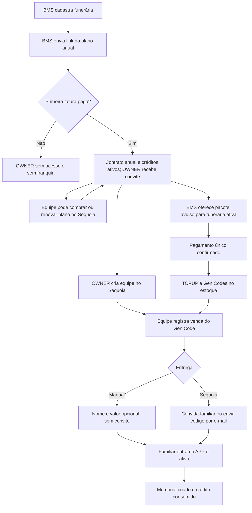

# Fluxo comercial atual — Genealogiq

**Verificado no código em:** 03/10/2026, `6e06634` + alterações locais de documentação/testes/launcher. Integrações Stripe/e-mail não foram exercitadas; veja [auditoria](audits/AGENT-MEMORY-2026-10-03.md).
**Escopo:** venda B2B para funerárias, gestão dos Gen Codes no Sequoia e ativação pelo cliente final no Genealogiq.

Este documento descreve o comportamento implementado no repositório. Os preços da tabela são os valores de partida registrados nas migrations do catálogo; como os planos e preços podem ser versionados no BMS, confirme o valor vigente no momento de enviar uma proposta.

## Sistemas e termos

- **BMS:** back office Genealogiq. Cadastra funerárias, mantém o catálogo e envia links de pagamento.
- **Sequoia (SEQ):** portal da funerária. Gerencia a equipe e o estoque de Gen Codes, registra vendas e acompanha ativações.
- **Genealogiq (APP):** experiência do familiar/cliente final. O guardião ativa o código e cria o memorial.
- **Funerária / tenant:** empresa cliente cadastrada no BMS. Os usuários e códigos do Sequoia ficam vinculados a essa empresa.
- **Gen Code:** código único que acompanha o QR Code físico. É o direito de ativar um memorial, não um plano de assinatura do familiar.
- **Crédito de ativação:** unidade de franquia concedida por um plano ou por pacote avulso. Uma unidade é consumida quando um familiar ativa um Gen Code.

No fluxo comercial atual, “vender QR Code” no Sequoia significa registrar a saída de um Gen Code para um familiar. O Sequoia pode enviar o código e o convite para o APP, mas essa ação **não cobra o familiar**. O valor informado na venda é apenas um registro comercial.

## Visão geral

1. **BMS cadastra a funerária** e informa o contato do proprietário. A conta do proprietário é criada sem acesso.
2. **BMS vende um plano anual** enviando um link de checkout, ou uma funerária já ativa compra/renova o plano pelo Sequoia.
3. **Stripe confirma o primeiro pagamento.** O sistema abre o ciclo do contrato, concede a franquia de ativações e libera o acesso do proprietário ao Sequoia.
4. **Proprietário/administrador da funerária cria usuários da equipe** no Sequoia.
5. **Equipe administra e vende Gen Codes** pelo estoque do Sequoia, por registro manual ou com entrega por e-mail.
6. **Familiar ativa o código no Genealogiq.** O APP cria o memorial, consome um crédito e aplica o período de teste configurado no plano, se houver.
7. **Se o estoque precisar de reposição**, BMS envia um link de compra avulsa de pacote de Gen Codes a uma funerária ativa, inclusive sem contrato anual.

## Papéis e ações

| Papel | Ações no fluxo |
|---|---|
| **BMS — SUPER_ADMIN, OWNER ou ADMIN** | Cadastrar e manter funerárias; configurar planos B2B, preços e cupons; sincronizar planos e o pacote avulso com Stripe; enviar links de checkout; acompanhar contratos e pedidos. As ações de escrita e venda citadas usam a autorização de administrador do BMS. |
| **BMS — COMERCIAL, FINANCE ou USER** | Esses papéis existem no cadastro de usuários, mas as ações de cadastro e checkout descritas aqui exigem SUPER_ADMIN, OWNER ou ADMIN. Portanto, COMERCIAL, FINANCE e USER não conseguem concluir essas operações com as permissões atuais. |
| **Funerária — OWNER ou ADMIN** | Acessar o Sequoia após a liberação; convidar usuários, atribuir papéis, editar, desativar ou remover usuários; comprar ou renovar um plano pela loja do Sequoia; operar o estoque e os registros de venda como qualquer usuário autenticado do tenant. |
| **Funerária — COMERCIAL, FINANCE ou USER** | Usar as funções operacionais do tenant, incluindo consultar estoque, marcar código como impresso, registrar/estornar venda ainda não ativada e acompanhar ativações. Esses papéis não podem administrar usuários; essa área exige OWNER, ADMIN ou SUPER_ADMIN. A compra self-service atual usa apenas verifyTenantSession e permite qualquer usuário do tenant; a divergência com a regra de compra administrativa está registrada em [PARTNER-PURCHASING](../apps/seq/docs/PARTNER-PURCHASING.md). |
| **Familiar / guardião — APP_USER** | Entrar no Genealogiq, preencher os dados do memorial e ativar o Gen Code. A ativação associa o memorial ao guardião e consome o crédito da funerária. |
| **Pessoa memorializada — APP_MEMO** | É o perfil criado pela ativação. Não é um usuário de operação do BMS ou do Sequoia. O familiar/guardião mantém o memorial no APP. |

As permissões acima descrevem as ações de venda e gestão de equipe encontradas nas ações do servidor. No Sequoia, a operação dos Gen Codes é limitada ao tenant da sessão.

## Planos B2B vendidos à funerária

Os planos B2B são contratos anuais da funerária. Cada ciclo libera uma quantidade de ativações. O catálogo inicial contém:

| Plano | Ativações por ciclo anual | BRL à vista | BRL em 12 parcelas | USD à vista | USD em 12 parcelas | MXN à vista | MXN em 12 parcelas |
|---|---:|---:|---:|---:|---:|---:|---:|
| Semente | 100 | R$ 2.990,00 | 12 × R$ 299,00 | US$ 585,00 | 12 × US$ 58,50 | MX$ 9.880,00 | 12 × MX$ 988,00 |
| Raiz | 200 | R$ 5.390,00 | 12 × R$ 539,00 | US$ 1.055,00 | 12 × US$ 105,50 | MX$ 17.810,00 | 12 × MX$ 1.781,00 |
| Árvore | 300 | R$ 7.920,00 | 12 × R$ 792,00 | US$ 1.550,00 | 12 × US$ 155,00 | MX$ 26.170,00 | 12 × MX$ 2.617,00 |
| Floresta | 400 | R$ 10.200,00 | 12 × R$ 1.020,00 | US$ 1.995,00 | 12 × US$ 199,50 | MX$ 33.700,00 | 12 × MX$ 3.370,00 |

Os preços em 12 parcelas têm acréscimo comercial em relação ao preço à vista. O preço por ativação de referência também faz parte do cadastro do plano; não é calculado novamente a cada venda.

### Regras de franquia do plano

O BMS configura, por plano:

- franquia anual de ativações;
- percentual e validade do rollover de créditos não usados;
- prazo de carência do ciclo;
- validade da reserva de crédito para uma venda identificada;
- duração e plano B2C concedidos como teste quando um Gen Code é ativado.

Nos valores iniciais do catálogo, o rollover padrão é de até **30% da franquia do plano renovado**, com validade de **6 meses**; a carência padrão é **30 dias**; uma venda identificada pode reservar o crédito por **12 meses**; e a ativação concede **12 meses do plano PREMIUM** ao guardião. Os valores são configuráveis no BMS. Créditos que não forem carregados pelo rollover expiram com o ciclo; o mesmo crédito não pode ser carregado repetidamente.

O ciclo é anual mesmo quando o cliente escolhe parcelas mensais. As parcelas pagam o contrato anual: não concedem uma nova franquia a cada cobrança. O sistema abre o próximo ciclo quando a fatura paga corresponde a um novo período, e não para cada parcela mensal.

### Preços e moedas

O checkout usa o preço ativo e sincronizado com Stripe para a moeda da interface: BRL no fluxo em português, MXN no fluxo em espanhol do México e USD como opção em inglês/fallback. Um plano sem preço ativo e sincronizado nessa moeda não aparece como opção de compra.

Ajustes de preço criam uma nova versão no BMS, que precisa ser sincronizada com Stripe antes de voltar a ser vendida. Contratos e ciclos anteriores preservam os dados e o preço que aceitaram.

## Fluxo A — BMS cadastra e vende o primeiro plano

1. **Cadastrar funerária:** no BMS, registrar os dados da empresa e os dados de contato do proprietário (OWNER). O cadastro cria a funerária e o usuário OWNER, mas o usuário fica inativo, sem senha, token de acesso ou e-mail de boas-vindas.
2. **Preparar oferta:** manter o plano ativo, cadastrar preço na moeda da venda e sincronizar plano/preço com Stripe. Opcionalmente, cadastrar e sincronizar cupom de desconto.
3. **Enviar checkout:** em Vendas → Contratos → Novo, selecionar funerária, plano, pagamento à vista ou parcelas e, se aplicável, cupom. Com um cupom selecionado, o BMS aplica o código no checkout; sem seleção, o checkout permite que o comprador informe um código promocional. O BMS envia o link recorrente por e-mail ao contato da funerária. O link expira em aproximadamente 23 horas.
4. **Pagamento:** a funerária conclui o checkout no Stripe. O registro de contrato começa como PENDING; os créditos e o acesso só são liberados após a confirmação da primeira fatura paga.
5. **Liberação automática:** quando a primeira fatura é paga, o sistema abre o primeiro ciclo anual, concede a franquia do plano, registra o contrato como ativo e libera o usuário OWNER. O BMS envia o e-mail de boas-vindas para o OWNER definir a senha do Sequoia. Renovações não reenviam esse convite se o OWNER já estiver ativo.
6. **Ativação da operação:** o OWNER entra no Sequoia e cria os demais usuários da funerária em Sistema → Usuários.

**Se não houver pagamento:** não se libera o login do OWNER e não se concede a franquia anual. O cadastro da funerária permanece no BMS para que a oferta possa ser retomada.

## Fluxo B — funerária compra ou renova no Sequoia

1. Um usuário autenticado da funerária abre Compras → Comprar Gen Codes.
2. O Sequoia mostra planos ativos que tenham preço e produto Stripe sincronizados para a moeda da interface.
3. O usuário escolhe o plano e o pagamento à vista ou parcelado disponível.
4. O checkout recorrente é aberto pelo Stripe. Ao pagar, segue o mesmo processamento de contrato, ciclo e créditos descrito acima.
5. O histórico de pedidos de plano fica na mesma tela. A funerária pode comprar plano por conta própria porque já tem acesso ao Sequoia.

O link do BMS e a loja do Sequoia chegam ao mesmo modelo de contrato e usam a mesma regra de concessão de créditos. A diferença é quem inicia o checkout e como o comprador recebe o link.

## Fluxo C — pacote avulso de Gen Codes (reposição)

O pacote é separado do plano anual: é uma compra única de créditos extras e não altera a franquia anual. A implementação de 2c2ceb3 permite pacotes com preço/moeda, quantidade mínima, bônus e condições de trial próprios. O BMS envia pedidos ao tenant ativo, inclusive sem contrato anual. A tabela abaixo registra valores históricos de partida; confirme o catálogo vigente no banco antes de enviar uma proposta.

| Pacote inicial | Preço unitário | Pedido mínimo | Total mínimo | Validade do crédito |
|---|---:|---:|---:|---:|
| Pacote de Gencodes, BRL | R$ 150,00 | 20 códigos | R$ 3.000,00 | 12 meses |

1. No BMS, sincronizar o pacote com Stripe, se ainda não estiver sincronizado.
2. Em Gen Codes → Novo pedido, escolher uma funerária ativa, com ou sem contrato anual e informar uma quantidade inteira a partir do mínimo do catálogo (20 no pacote inicial).
3. O BMS calcula o total, cria o pedido e envia ao e-mail da funerária um link de checkout de pagamento único. O link expira em aproximadamente 23 horas.
4. Após pagamento confirmado, o sistema registra o pedido como PAID, lança uma concessão TOPUP com validade própria de 12 meses e cria a quantidade comprada mais o bônus registrado no pedido como Gen Codes no estoque do Sequoia.
5. Pedido expirado ou com pagamento recusado não concede crédito nem cria códigos. O histórico do BMS registra o estado do pedido.

O pedido avulso exige tenant ativo e não exige ciclo anual. O pagamento pode liberar o OWNER para entrar no Sequoia; o TOPUP tem sua própria validade. O crédito avulso não participa de rollover. A exigência de contrato anual foi removida em 2c2ceb3.

## Fluxo D — equipe da funerária vende o Gen Code ao familiar

Os códigos do estoque são vinculados à funerária e aparecem no Sequoia como **Disponível**, **Vendido** ou **Ativado**. O ciclo concede créditos e o sistema mantém códigos disponíveis em quantidade compatível com o saldo de créditos não utilizados.

### Caminho 1: registro manual

1. O usuário da funerária escolhe um código disponível e registra o nome do comprador e, se desejar, o valor da venda.
2. O Sequoia registra a baixa como venda manual, reserva o crédito e marca o código como **Vendido**.
3. A cobrança e a entrega física ficam com a funerária. O Sequoia não cria uma conta do familiar nem envia código por e-mail nesse caminho.
4. O familiar acessa o Genealogiq e ativa o código quando tiver uma conta e estiver autenticado.

Essa reserva fica vinculada ao crédito original do ciclo. Portanto, o registro manual não protege o código contra o vencimento do crédito daquele ciclo.

### Caminho 2: venda com entrega pelo Sequoia

1. O usuário informa nome, sobrenome e e-mail do familiar e, opcionalmente, o valor registrado da venda.
2. O Sequoia marca o código como **Vendido** e associa o familiar. Se ele ainda não tiver conta, o sistema cria seu usuário APP e envia um convite para definir senha com um link que volta à ativação do código. Se já tiver senha, envia o código por e-mail; se a conta existir, mas ainda não tiver senha, envia o convite para concluir o cadastro.
3. O Sequoia reserva o crédito para aquele código/familiar pelo prazo de reserva configurado no plano. A reserva pode continuar válida depois do fim do ciclo, para que a família que já comprou não perca a ativação.
4. O código pode ser desfeito enquanto estiver apenas como **Vendido**. Depois da ativação, a ação de estorno não se aplica.

O e-mail do familiar precisa estar livre para esse tenant; um cadastro ligado a outra funerária não pode ser reatribuído silenciosamente.

### Impressão e instalação

A equipe pode marcar o Gen Code como impresso no inventário. Depois que há um perfil memorializado, o Sequoia também permite acompanhar e marcar o QR do perfil como impresso ou instalado. Esses estados operacionais não substituem os estados comerciais do Gen Code.

## Fluxo E — familiar ativa o código no Genealogiq

1. O familiar entra no Genealogiq (ou define a senha pelo convite enviado pelo Sequoia) e abre o QR Code/link do Gen Code.
2. Preenche os dados necessários do memorial, como nome e datas relevantes.
3. O sistema valida se o código ainda tem crédito ou uma reserva válida, cria o perfil memorializado, associa-o ao guardião e marca o Gen Code como **Ativado**.
4. A mesma operação consome um crédito. Quando configurado no plano da funerária, o guardião recebe também o período de teste do plano B2C indicado no cadastro do parceiro.
5. O familiar pode continuar no APP para administrar o memorial e, separadamente, adquirir um plano B2C caso queira os recursos oferecidos ao consumidor.

Uma ativação concluída não é desfeita quando o plano B2B da funerária termina: a cobrança do plano controla novas ativações; o memorial já ativado permanece disponível para a família.

## Produtos que não devem ser confundidos

- **Plano de parceiro B2B:** contrato anual da funerária que concede créditos de ativação; vendido pelo BMS ou pela loja do Sequoia.
- **Pacote avulso de Gen Codes:** compra única de pelo menos 20 unidades no catálogo inicial; vendido pelo BMS a uma funerária com ciclo ativo.
- **Plano B2C do Genealogiq:** assinatura do familiar/guardião no APP. É configurada separadamente em BMS → Assinaturas e não é um plano B2B da funerária.
- **Gen Code / QR físico:** unidade que a funerária entrega ao familiar e que ativa um memorial. O Sequoia registra a venda, mas não cobra o familiar por essa ação.

## Acompanhamento por estado

- **Contrato B2B:** PENDING, ACTIVE, PAST_DUE, EXPIRED ou CANCELLED.
- **Pedido avulso:** PENDING, PAID, FAILED ou EXPIRED.
- **Gen Code:** AVAILABLE, SOLD ou ACTIVATED.
- **Crédito:** concessão por ciclo, rollover, venda identificada ou top-up; a ativação consome uma unidade.

BMS acompanha contratos e pedidos avulsos. Sequoia acompanha saldo/franquia, estoque e ativações da funerária. Genealogiq recebe a ativação e apresenta o memorial à família.

## Referências no repositório

- Cadastro de funerária e OWNER: apps/bms/src/actions/customer.actions.ts
- Checkout B2B pelo BMS: apps/bms/src/actions/partner-plan.actions.ts
- Checkout B2B pelo Sequoia: apps/seq/src/actions/partner-plan.actions.ts
- Planos e preços iniciais: packages/db/prisma/migrations/20260825234000_seed_partner_plans/migration.sql
- Catálogo e checkout do pacote avulso: apps/bms/src/actions/gencode-package.actions.ts e packages/services/src/gencode-package.ts
- Liberação do acesso após pagamento: apps/bms/src/lib/billing.ts e apps/bms/src/app/api/stripe/webhook/route.ts
- Venda/estorno de Gen Code no Sequoia: apps/seq/src/actions/gencode.actions.ts
- Ativação pelo familiar: apps/app/src/actions/gencode.actions.ts

## Verificação e limites em 03/10/2026

A implementação atual permite pacote avulso para tenant ativo sem contrato anual. O self-service do Sequoia verifica associação ao tenant, sem verifyAdmin. O envio BMS do checkout anual ainda retorna a `/sales/manual-sales`, rota removida; o problema está em [PARTNER-PLANS-CONTRACTS](../apps/bms/docs/PARTNER-PLANS-CONTRACTS.md). O catálogo pode mudar no banco; valores históricos não foram consultados na produção nesta auditoria.

| Data | Revisão | Escopo | Evidência / limites |
| --- | --- | --- | --- |
| 03/10/2026 | 6e06634 + alterações locais | Código | Ações de compra/pacote e autorização verificadas; Stripe/e-mail/replay completos n/a. Original preservado em [history](history/FLUXO-COMERCIAL-2026-10-03.md). |
